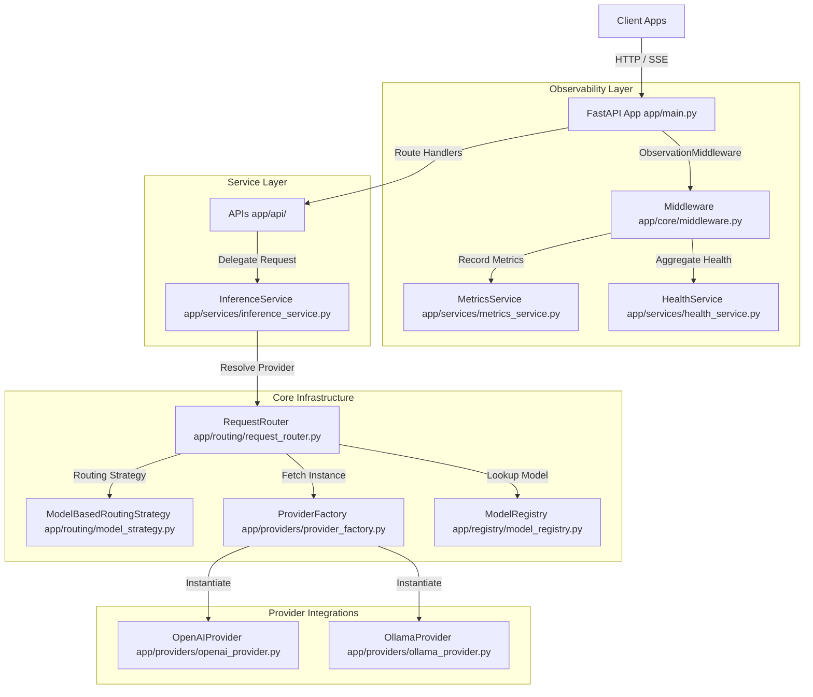
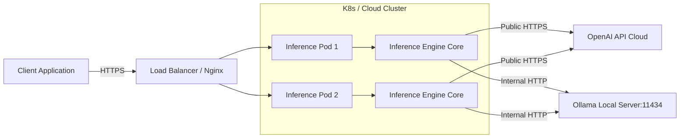

# Architecture Documentation

This document describes the high-level architecture, component design, and deployment model of the LLM Inference Engine.

## System Architecture Overview

The engine is built as a modular FastAPI gateway designed for clean separation of concerns, pluggable AI providers, and robust observability.



---

## Component Description

### 1. Presentation/Transport Layer (`app/main.py`, `app/api/`)
Handles HTTP protocol serialization, validation, routing, middleware processing, and exception translation.
- **FastAPI Application**: Orchestrates lifecycle states (startup/shutdown) via lifespan events.
- **API Routers**: Exposes endpoint handlers (`/chat/completions`, `/models`, `/health`).
- **ObservationMiddleware**: Manages correlation IDs, latency measurement, and request logging.
- **Exception Handlers**: Standardizes errors into structured, client-facing JSON payloads.

### 2. Business Logic/Orchestration Layer (`app/services/`)
Coordinates business workflow executions.
- **InferenceService**: Coordinates model verification, routing, response translation, and metrics updates.
- **HealthService**: Compiles detailed overall system readiness logs on demand.
- **MetricsService**: Provides a thread-safe repository for latency data and error rates.

### 3. Core Infrastructure & Routing (`app/routing/`, `app/registry/`, `app/providers/`)
Implements backend-agnostic interfaces.
- **ModelRegistry**: Manages registered model definitions in a thread-safe local metadata store.
- **RequestRouter**: Resolves provider mappings based on routing strategies.
- **ProviderFactory**: Dynamically instantiates pluggable provider modules.
- **Providers (OpenAI/Ollama)**: Translate generic API inference commands into backend SDK or HTTP queries.

---

## Dependency Graph

```
           [app/main.py]
                 │
      ┌──────────┴──────────┐
      ▼                     ▼
[app/api/*]         [app/core/container.py]
      │                     │
      ▼                     ├──────────────────────────┐
[app/services/*]            ▼                          ▼
      │             [app/registry/*]           [app/routing/*]
      │                     ▲                          │
      │                     │                          │
      └─────────┬───────────┴───────────┬──────────────┘
                ▼                       ▼
       [app/providers/*]         [app/schemas/*]
```

---

## Deployment Diagram

The application can be deployed as a containerized service (Docker) scaled behind a load balancer, routing LLM requests to either public cloud APIs (OpenAI) or local/private server endpoints (Ollama).


