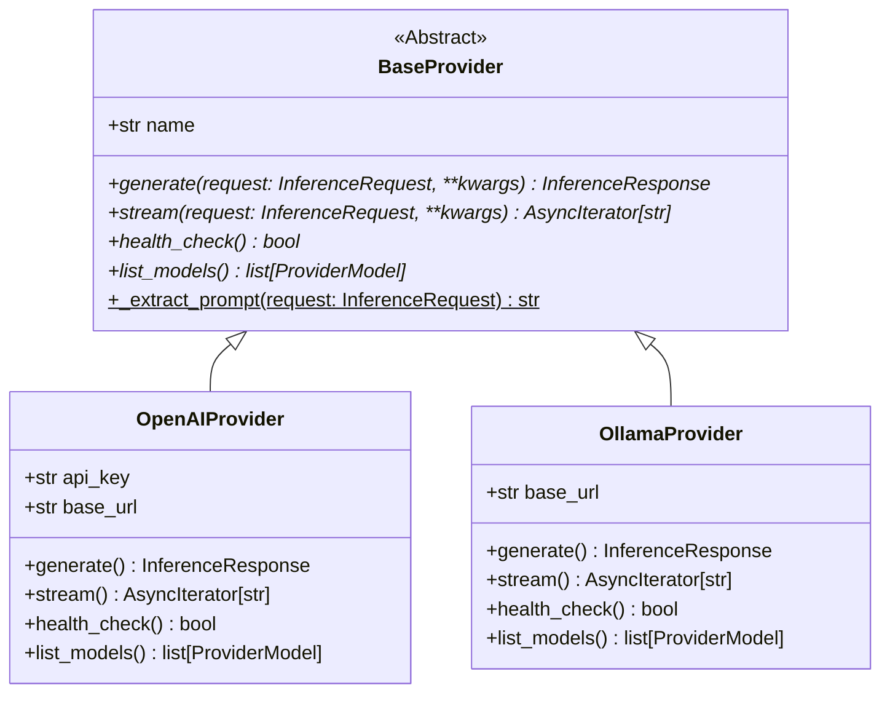

# Provider Abstraction Layer

This document details the provider interface, discovery mechanics, and lifecycle management within the LLM Inference Engine.

## Abstraction Design

Downstream provider specifics (e.g., OpenAI API, local Ollama endpoints) are abstracted behind the [BaseProvider](file:///c:/Users/Yogesh E/OneDrive/Desktop/Manjus/llm-inference-engine/app/providers/base_provider.py#L32) class. This allows the core request orchestration logic to remain completely decoupleable from specific API SDKs or client drivers.



---

## The BaseProvider Interface

Every provider module must implement the following operations:
1. `generate(request, model, prompt, **kwargs) -> InferenceResponse`: Emits a complete LLM response based on the standardized input payload.
2. `stream(request, model, prompt, **kwargs) -> AsyncIterator[str]`: Streams generated text chunks using SSE formatting.
3. `health_check() -> bool`: Returns `True` if connection and authentication state are healthy.
4. `list_models() -> list[ProviderModel]`: Returns the list of model metadata exposed by the provider.

---

## Provider Lifecycle & Factory

The [ProviderFactory](file:///c:/Users/Yogesh E/OneDrive/Desktop/Manjus/llm-inference-engine/app/providers/provider_factory.py#L8) acts as the central registry for provider implementations.

### 1. Registration Phase (Startup)
During application bootstrapping, the factory registers default provider builders:
```python
factory.register_provider("openai", OpenAIProvider)
factory.register_provider("ollama", OllamaProvider)
```
The factory registers either raw provider classes (which it instantiates as singletons or on-demand) or callable factory methods.

### 2. Resolution Phase (Runtime)
When a request arrives, the service resolves the correct provider instance by calling `factory.get_provider(name)`. The factory verifies registry existence, instantiates/resolves the provider instance, and validates its type compatibility.

### 3. Health Checks
The `HealthService` and `InfrastructureInitializer` periodically poll provider health:
- Queries the provider's `health_check()` method.
- Compiles the status into a strongly typed `ProviderHealth` instance.
