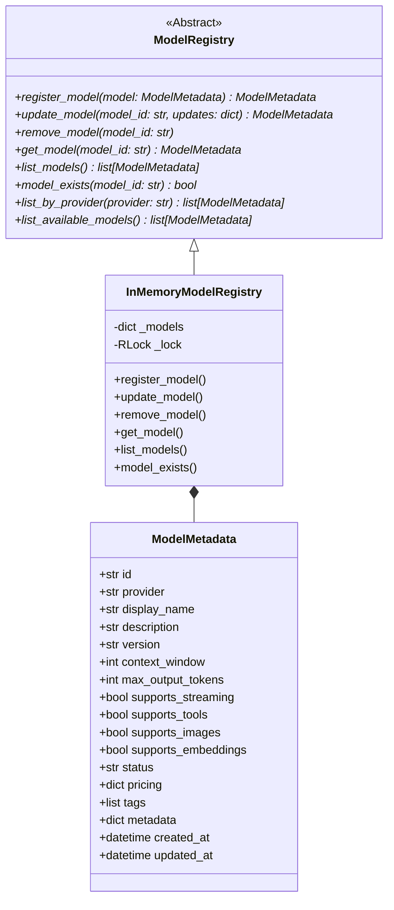

# Model Registry Design

This document describes the structure and thread-safety details of the model metadata registry.

## Registry Interface and Classes

---

## 1. ModelMetadata Schema

The `ModelMetadata` object is a strongly typed dataclass storing key model properties (e.g. context windows, provider, features support, and current status). It automatically sets `created_at` and `updated_at` properties to timezone-aware UTC datetimes on instantiation.

---

## 2. In-Memory Registry Implementations

The primary registry implementation is the `InMemoryModelRegistry`. It manages model configurations locally using an internal dictionary.

### Thread Safety Design
Since multiple requests are served concurrently in FastAPI, registry mutation and retrieval methods are wrapped with a `threading.RLock` (re-entrant lock) context manager:
- `RLock` ensures that concurrent writes (e.g., during model discovery or manual updates) do not result in race conditions.
- Reads (e.g., model retrieval, exists checks, list queries) also acquire the `RLock` to guarantee consistency against partial updates.

### Seeding Rules
On creation, the registry seeds a set of default developer models:
1. `gpt-4o-mini`: Configured for the `openai` provider, status is `available`.
2. `llama3.1`: Configured for the `ollama` provider, status is `available`.

During startup, the application discovery process queries active providers and registers newly discovered models dynamically.
