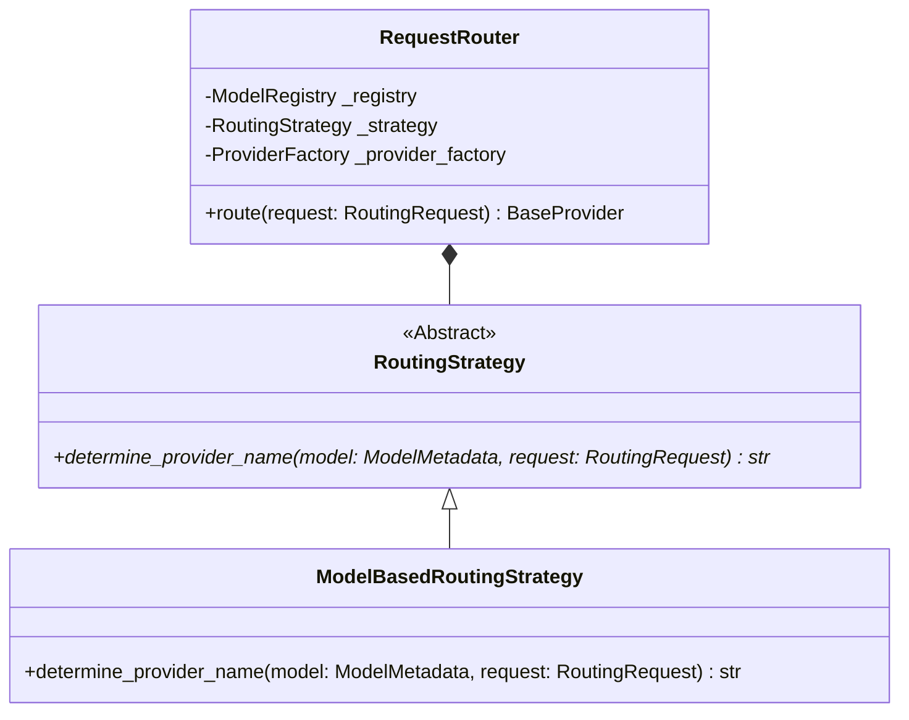

# Request Routing Flow

This document details how requests are routed to downstream providers using pluggable routing strategies.

## Routing System Design

The routing system contains three core components:
1. [RequestRouter](file:///c:/Users/Yogesh E/OneDrive/Desktop/Manjus/llm-inference-engine/app/routing/request_router.py#L21): Handles the orchestration of routing decisions (validation, strategy invocation, instance retrieval).
2. [RoutingStrategy](file:///c:/Users/Yogesh E/OneDrive/Desktop/Manjus/llm-inference-engine/app/routing/routing_strategy.py#L10): Declares the interface for routing strategies.
3. [ModelBasedRoutingStrategy](file:///c:/Users/Yogesh E/OneDrive/Desktop/Manjus/llm-inference-engine/app/routing/model_strategy.py#L11): Realizes model prefix-based routing rules.

---

## Routing Execution Pipeline

When the `InferenceService` processes an incoming completion request, it delegates provider resolution to the `RequestRouter`:

1. **Parameter Validation**: The router verifies that `model_id` is supplied in the request.
2. **Metadata Lookup**: It fetches the model details from the `ModelRegistry`. If the model is unregistered, a `ModelNotFoundException` is raised.
3. **Strategy Query**: It invokes the strategy's `determine_provider_name` method.
   - For `ModelBasedRoutingStrategy`:
     - If the model's `provider` field is populated, that provider name is returned.
     - Else, it falls back to parsing model prefix rules (e.g., `gpt*` -> `openai`, `llama*`/`mistral*` -> `ollama`).
4. **Instantiation**: The router queries the `ProviderFactory` for the named provider instance and returns it back to the inference orchestrator.
