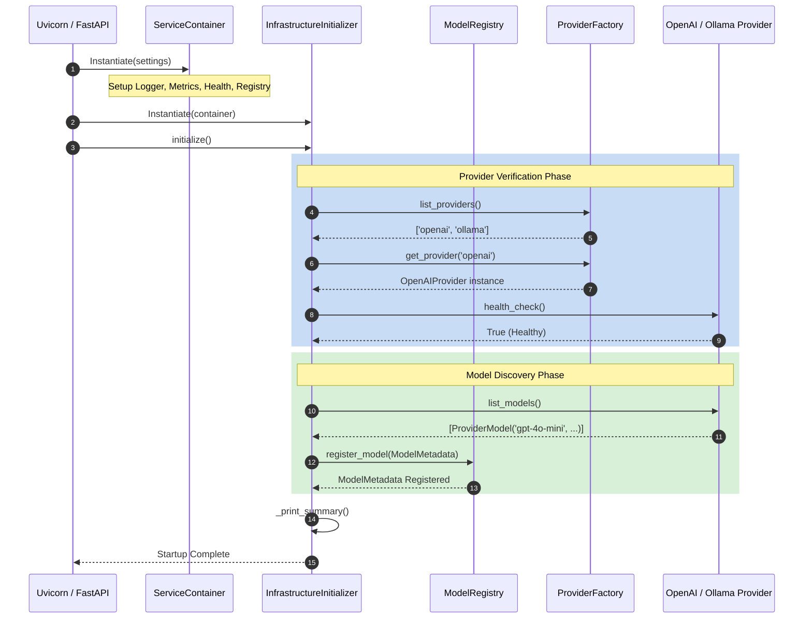
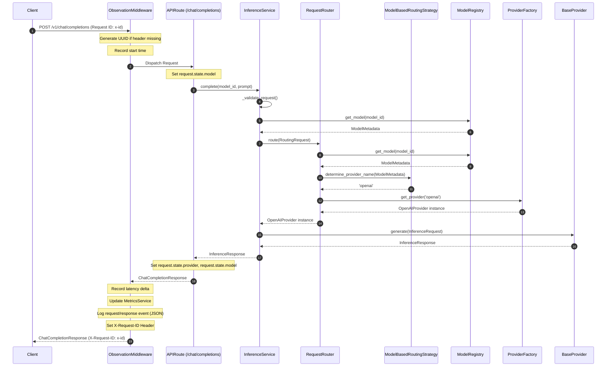

# Sequence Diagrams

This document details the sequence diagrams for system startup and chat completion execution flows.

## 1. Application Startup Flow

```mermaid
sequenceDiagram
    autonumber
    participant Server as Uvicorn / FastAPI
    participant Container as ServiceContainer
    participant Initializer as InfrastructureInitializer
    participant Registry as ModelRegistry
    participant Factory as ProviderFactory
    participant Provider as OpenAI / Ollama Provider

    Server->>Container: Instantiate(settings)
    Note over Container: Setup Logger, Metrics, Health, Registry
    Server->>Initializer: Instantiate(container)
    Server->>Initializer: initialize()
    
    rect rgb(200, 220, 245)
        Note over Initializer, Provider: Provider Verification Phase
        Initializer->>Factory: list_providers()
        Factory-->>Initializer: ['openai', 'ollama']
        Initializer->>Factory: get_provider('openai')
        Factory-->>Initializer: OpenAIProvider instance
        Initializer->>Provider: health_check()
        Provider-->>Initializer: True (Healthy)
    end

    rect rgb(215, 240, 215)
        Note over Initializer, Provider: Model Discovery Phase
        Initializer->>Provider: list_models()
        Provider-->>Initializer: [ProviderModel('gpt-4o-mini', ...)]
        Initializer->>Registry: register_model(ModelMetadata)
        Registry-->>Initializer: ModelMetadata Registered
    end

    Initializer->>Initializer: _print_summary()
    Initializer-->>Server: Startup Complete
```

---

## 2. Chat Completion Request Flow

```mermaid
sequenceDiagram
    autonumber
    participant Client
    participant Middleware as ObservationMiddleware
    participant Route as APIRoute (/chat/completions)
    participant Service as InferenceService
    participant Router as RequestRouter
    participant Strategy as ModelBasedRoutingStrategy
    participant Registry as ModelRegistry
    participant Factory as ProviderFactory
    participant Provider as BaseProvider

    Client->>Middleware: POST /v1/chat/completions (Request ID: x-id)
    Note over Middleware: Generate UUID if header missing
    Note over Middleware: Record start time

    Middleware->>Route: Dispatch Request
    Note over Route: Set request.state.model

    Route->>Service: complete(model_id, prompt)
    Service->>Service: _validate_request()
    Service->>Registry: get_model(model_id)
    Registry-->>Service: ModelMetadata

    Service->>Router: route(RoutingRequest)
    Router->>Registry: get_model(model_id)
    Registry-->>Router: ModelMetadata
    Router->>Strategy: determine_provider_name(ModelMetadata)
    Strategy-->>Router: 'openai'
    Router->>Factory: get_provider('openai')
    Factory-->>Router: OpenAIProvider instance
    Router-->>Service: OpenAIProvider instance

    Service->>Provider: generate(InferenceRequest)
    Provider-->>Service: InferenceResponse
    Service-->>Route: InferenceResponse
    
    Note over Route: Set request.state.provider, request.state.model
    Route-->>Middleware: ChatCompletionResponse
    
    Note over Middleware: Record latency delta
    Note over Middleware: Update MetricsService
    Note over Middleware: Log request/response event (JSON)
    Note over Middleware: Set X-Request-ID Header
    Middleware-->>Client: ChatCompletionResponse (X-Request-ID: x-id)
```
